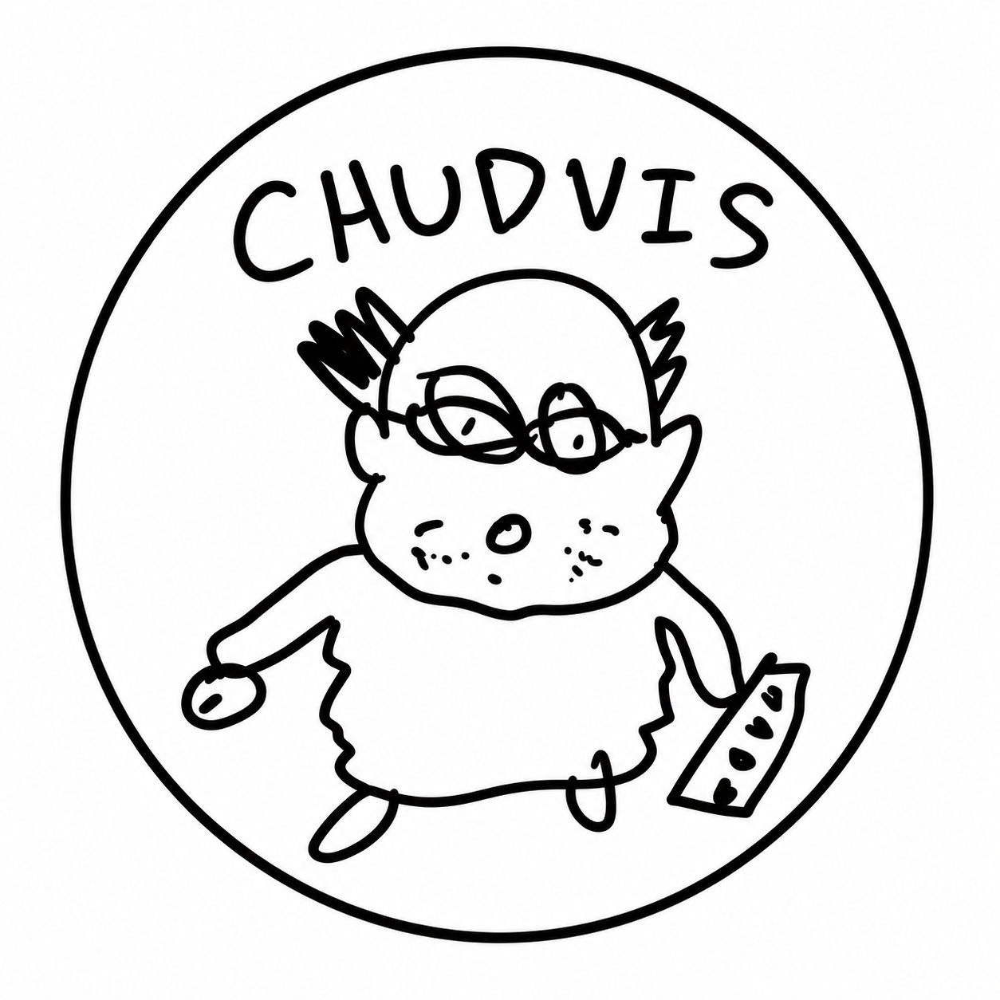

<p align="center">
  
</p>

# Chudvis

Chudvis is a hands-free control system for VS Code and the desktop. It uses a webcam to estimate
gaze, recognizes deliberate hand gestures, and accepts voice requests after the local “Chudvis”
wake word.

The VS Code extension is the primary experience. It owns the complete IDE lifecycle: it starts and
stops the packaged native Python runtime, manages the loopback bridge, turns gaze and gestures into
editor-aware actions, routes voice requests, validates proposed edits, and presents review and Undo
inside VS Code.

> [!IMPORTANT]
> Installing or opening the extension does not start the camera, microphone, or controls. Start and
> stop Chudvis explicitly with `Ctrl+Alt+G` (`Cmd+Alt+G` on macOS), the sidebar button, the status-bar
> item, or a Command Palette command. An installed extension does not require a separate
> `uv run chudvis ide` terminal.

## Modes

| Mode                 | Purpose                                                                                       | How it starts                                      |
| -------------------- | --------------------------------------------------------------------------------------------- | -------------------------------------------------- |
| VS Code IDE mode     | Gaze selection, two-hand editor gestures, voice navigation, questions, and guarded code edits | Started and supervised by the extension            |
| Tracking diagnostics | Safely inspect gaze, both hands, gesture thresholds, and calibration quality without OS input | **Test Tracking** in the sidebar or `chudvis test` |
| Desktop mode         | Raw gaze-controlled pointer, click, drag, scroll, pause, and local dictation outside VS Code  | Standalone `chudvis run` command                   |

## VS Code quick start

### 1. Install the extension

Requirements for an installation from source:

- VS Code 1.95 or newer, with its `code` CLI on `PATH`
- Node.js and npm to build the extension
- [`uv`](https://docs.astral.sh/uv/) available on the native host that owns the camera and VS Code UI
- A webcam; a microphone is needed only for voice

From WSL, Linux, or macOS, build, test, package, and install the extension with:

```bash
./scripts/install-vscode-extension.sh
```

On native Windows, run:

```powershell
Set-Location editors\vscode
npm ci
npm run verify
npm run package
Set-Location ..\..
powershell -ExecutionPolicy Bypass -File .\scripts\install-vscode-extension.ps1
```

Then run **Developer: Reload Window** in VS Code.

For a Windows or Remote WSL VS Code window, install Windows `uv` once if it is not already
available:

```powershell
winget install --id astral-sh.uv -e
```

Restart VS Code after changing the Windows `PATH`. On its first native launch, Chudvis creates an
isolated environment under `%LOCALAPPDATA%\Chudvis\windows-venv` and downloads the required Python
and model assets. The repository's WSL or Linux `.venv` is not used by the extension.

### 2. Configure AI and voice services

Gaze and hand controls do not require cloud credentials. For the complete voice workflow:

1. Open **AI and voice setup** in the Chudvis sidebar.
2. Choose **Set Backboard Key**. Chudvis validates the key and configured models.
3. Choose **Set ElevenLabs Key**. Chudvis passes it securely to the native runtime on Start.

Both keys are stored in VS Code SecretStorage and their setup state is shown in the sidebar. Chudvis
does not load workspace `.env` files. This avoids confusing WSL environment files with the native
Windows process and prevents workspace code from reading service credentials.

An existing `ELEVENLABS_API_KEY` in the native VS Code host environment remains supported as a
fallback. On Windows, it can be set with:

```powershell
[Environment]::SetEnvironmentVariable("ELEVENLABS_API_KEY", "your-key", "User")
```

Restart VS Code after changing a host environment variable. A key entered in the sidebar does not
require a restart; it is used the next time controls start. Backboard is never read from an
environment variable—it is an extension-side credential used only for questions and edits.

The first time live controls start, the extension shows a disclosure describing what is processed
locally and what is sent to ElevenLabs and Backboard. Declining leaves Chudvis stopped. If wake-word
streaming is unavailable but the local speech dependencies work, editor-hand thumbs-up remains
available as the confirmed local Whisper fallback.

### 3. Calibrate gaze

Open the Chudvis icon in the left Activity Bar and choose **Recalibrate Gaze**. Keep the same seating
position, display scaling, camera placement, and lighting that you will use during control. Keep
your head reasonably still and look at each target with your eyes.

Calibration uses a dense 5x5 target grid, balanced samples, outlier and blink rejection, followed by
a separate validation pass. Chudvis records median and p95 validation error and warns before live
control when the saved profile is poor.

Calibration is stored for the native runtime. In a Windows/WSL setup, calibrating with plain Linux
`uv run` creates the wrong platform profile; use the extension's button so calibration and live
control share the Windows screen geometry and DPI awareness.

### 4. Test tracking safely

Choose **Test Tracking** in the sidebar before enabling live input. Diagnostics uses the same
two-hand tracker, gaze estimator, smoothing, and confidence gate as IDE mode, but never emits mouse
or keyboard actions. Close the diagnostics window when finished.

The dashboard shows:

- Face, iris, and complete hand landmarks
- Physical left/right hand labels and IDE editor/navigator roles
- Gaze readiness, confidence, blink state, and eye openness
- Pinch, open-palm, and thumbs-up recognition
- Gesture arming, hold progress, cancellations, and completed events
- Loaded calibration model and held-out median/p95 error
- The current calibrated gaze position on a mini screen and full dashboard

Press `G` to toggle the full-dashboard gaze reticle and `Esc` to close diagnostics.

The dashboard reticle is a visualization, so it can look steadier than a real OS pointer. Live IDE
mode also runs both-hand tracking and voice processing at the same time. Large live-vs-dashboard
differences usually indicate a weak or mismatched calibration, changed camera/head position,
different Windows display scaling, low light, or an incorrect camera. Recalibrate from the
extension under the conditions in which Chudvis will be used.

### 5. Start and stop Chudvis

Use any of these equivalent controls:

- Press `Ctrl+Alt+G` on Windows/Linux or `Cmd+Alt+G` on macOS.
- Click **Start Controls** or **Stop Controls** in the Chudvis sidebar.
- Click the Chudvis status-bar item.
- Run **Chudvis: Toggle Controls** from the Command Palette.

The status bar and sidebar show **Off** when controls are stopped. Stopping Chudvis terminates its
native gaze, gesture, and voice process. Calibration and diagnostics are also explicit actions and
never enable live controls automatically.

## Chudvis sidebar

The left sidebar is both the quick-start surface and the request/review interface. It includes:

- Synchronized **Start/Stop Controls**, **Test Tracking**, and **Recalibrate Gaze** buttons
- A compact table grouping actions under no hand, editor hand, navigator hand, or either hand
- Backboard and ElevenLabs setup status with secure key-entry buttons
- Live voice state and partial transcription
- The current request, resolved source target, and streamed answer
- Apply, Cancel, Open Changes, guarded Undo, and Clear Memory actions
- A bounded session history

The same actions are available from the Command Palette:

| Command                                                                   | Purpose                                                       |
| ------------------------------------------------------------------------- | ------------------------------------------------------------- |
| **Chudvis: Toggle Controls**                                              | Start or stop the complete live-control runtime               |
| **Chudvis: Start Gaze, Gesture, and Voice Controls**                      | Explicitly start live controls                                |
| **Chudvis: Stop Gaze, Gesture, and Voice Controls**                       | Stop live controls and the native process                     |
| **Chudvis: Calibrate Gaze**                                               | Replace the native gaze calibration profile                   |
| **Chudvis: Test Tracking Safely**                                         | Open diagnostics without OS actions                           |
| **Chudvis: Cancel Pending Action**                                        | Cancel active selection, request, or edit work                |
| **Chudvis: Open Changes**                                                 | Reopen the current native diff or applied change              |
| **Chudvis: Undo Last Edit**                                               | Run guarded Undo when the applied snapshots still match       |
| **Chudvis: Next Captured Change** / **Chudvis: Previous Captured Change** | Navigate captured files and change ranges                     |
| **Chudvis: Configure Backboard API Key**                                  | Store and validate the Backboard key in VS Code SecretStorage |
| **Chudvis: Clear Backboard API Key**                                      | Remove the key from VS Code SecretStorage                     |
| **Chudvis: Configure ElevenLabs API Key**                                 | Store the ElevenLabs key for the native runtime               |
| **Chudvis: Clear ElevenLabs API Key**                                     | Remove the saved ElevenLabs key                               |
| **Chudvis: Clear Editing Memory**                                         | Delete the workspace editing thread and its saved IDs         |

The bridge-only Start/Stop commands are troubleshooting tools. **Start IDE Bridge** does not start
the camera or controls and is not part of the normal workflow.

## IDE controls

Hand roles default to the user's physical right hand for editing and physical left hand for
navigation. They are independent of the side on which a hand appears in the mirrored camera image.
Chudvis normalizes the detector labels before assigning roles.

| Input                                                | IDE action                                                                      |
| ---------------------------------------------------- | ------------------------------------------------------------------------------- |
| Gaze                                                 | Move the OS pointer toward a code target                                        |
| Editor-hand quick thumb/index pinch                  | Click the gaze position captured at pinch start and select the enclosing symbol |
| Editor-hand open palm moved vertically               | Scroll the active editor or diff                                                |
| Navigator-hand open palm moved vertically            | Move to the previous or next captured change                                    |
| Say “Chudvis,” then speak                            | Start one navigation, question, or explicit code-edit request                   |
| Editor-hand thumbs-up held                           | Approve an expanded edit, or start/confirm local Whisper fallback               |
| Either-hand open palm held while a request is active | Cancel the request                                                              |
| Either-hand open palm held otherwise                 | Pause or resume IDE control                                                     |

VS Code cannot map arbitrary desktop coordinates directly to a document position. Chudvis therefore
locks the latest fresh gaze sample when the editor-hand pinch begins, clicks that point when the
pinch is released, and accepts only the resulting selection during a short armed window. It then
selects the smallest enclosing document symbol, or the current line when symbols are unavailable.

### Voice requests

Each realtime request requires a fresh wake word. Examples include:

```text
Chudvis, open the configuration file
Chudvis, create a new markdown file named Hello
Chudvis, go to the startControls symbol
Chudvis, explain what this function does
Chudvis, rename this parameter to sessionToken
Chudvis, cancel
```

File creation, file and symbol navigation, references, Undo, and Cancel are executed locally. Spoken
extensions such as “dot P Y” are normalized, and bounded fuzzy matching tolerates small transcription
errors such as “plotform” for `platform.py`; ambiguous matches still require a Quick Pick. Questions
stream from Backboard into the sidebar using a temporary memory-free thread. Explicit edits to
existing code use a persistent workspace editing thread and exact-text operations.

Local creation accepts only explicit “create ... file” commands and bounded, non-secret,
non-binary relative workspace paths. It never overwrites an existing file. Backboard itself still
has no file-creation or shell tool.

Edits wholly inside the resolved selection or symbol can auto-apply. Any scope expansion opens a
native VS Code diff and waits for **Apply** or an editor-hand thumbs-up. Cancel or an open palm rejects
the proposal. Applied edits receive a guarded Undo that refuses to overwrite later document changes.

## Extension lifecycle and the local bridge

The extension and the Python runtime have separate responsibilities:

```text
webcam + microphone
        |
        v
native Chudvis runtime
  gaze + two-hand gesture recognition
  local wake-word detection
  ElevenLabs realtime speech when activated
        |
        | authenticated JSON-RPC over loopback
        v
VS Code extension
  semantic selection + editor navigation
  request routing + Backboard
  edit validation + native diff + Undo
  sidebar + status + lifecycle controls
```

The extension starts the loopback bridge and passes its actual private connection settings directly
to the supervised runtime. It prefers `127.0.0.1:8765`. If another VS Code window already owns that
port, an explicitly started second window automatically uses an ephemeral loopback port instead of
requiring the user to kill another process.

In Remote WSL, the extension runs in the Windows/UI extension host and launches the packaged runtime
through Windows PowerShell. Plain `uv run chudvis ide` inside WSL uses Linux camera and input APIs;
those events cannot control native Windows VS Code. This native-host boundary is why the extension
owns IDE startup instead of asking the user to run a separate script.

## Standalone desktop mode

Standalone mode is useful for raw desktop control, diagnostics development, and platforms where the
native Python process is launched directly. Python 3.10 through 3.12 is supported.

```bash
uv sync --extra voice --extra dev
uv run chudvis doctor
uv run chudvis calibrate
uv run chudvis test
uv run chudvis run
```

To omit speech dependencies:

```bash
uv sync --extra dev
uv run chudvis run --no-voice
```

Start with dry-run mode if global input support is uncertain:

```bash
uv run chudvis run --dry-run --preview
```

Linux raw input generally requires an X11 session. Wayland compositors may deny synthetic global
input. Press `Esc` in the optional preview window or `Ctrl+C` in the terminal for an emergency stop.

### Desktop controls

| Input                      | Desktop action                                               |
| -------------------------- | ------------------------------------------------------------ |
| Gaze                       | Move the desktop pointer                                     |
| Quick thumb/index pinch    | Click the gaze position captured when the pinch began        |
| Pinch and hold             | Start a drag; move the hand to drag and release to drop      |
| Open palm moved vertically | Scroll                                                       |
| Open palm held still       | Pause or resume all actions                                  |
| Thumbs-up held             | Start dictation; repeat to transcribe, type, and press Enter |

### Windows-native launcher from WSL

For standalone desktop development from a WSL checkout, use the included launcher:

```bash
./scripts/chudvis-windows.sh doctor --skip-camera
./scripts/chudvis-windows.sh calibrate --camera 0
./scripts/chudvis-windows.sh test --ide --camera 0
./scripts/chudvis-windows.sh run --preview --no-voice
```

It forwards additional arguments, uses Windows `uv` and Python 3.12, and shares the isolated
environment under `%LOCALAPPDATA%\Chudvis`. This launcher is not needed for installed IDE mode.

## CLI reference

```text
chudvis doctor [--camera N] [--skip-camera] [--ide]
chudvis calibrate [--camera N] [--profile PATH] [--grid-size 5|7]
chudvis test [--camera N] [--profile PATH] [--ide]
chudvis run [--camera N] [--profile PATH] [--preview] [--dry-run] [--no-voice]
chudvis ide [--camera N] [--profile PATH] [--preview] [--dry-run] [--no-voice]
            [--host HOST] [--port PORT] [--session-token TOKEN]
```

Use `chudvis --config PATH <command>` to load a custom JSON configuration. Copy
[`config.example.json`](config.example.json) as a starting point. The default configuration and
calibration paths are:

```text
~/.config/chudvis/config.json
~/.config/chudvis/calibration.json
```

For the native Windows extension runtime, `~` is the Windows user profile. Useful VS Code settings
include:

| Setting                          | Purpose                                                        |
| -------------------------------- | -------------------------------------------------------------- |
| `chudvis.runtime.preview`        | Show a compact camera preview during live IDE control          |
| `chudvis.runtime.voice`          | Enable wake-word voice and local Whisper fallback              |
| `chudvis.runtime.uvExecutable`   | Native `uv` executable name or absolute path                   |
| `chudvis.runtime.pythonVersion`  | Python version used for the isolated runtime; defaults to 3.12 |
| `chudvis.runtime.extraArguments` | Extra CLI arguments, for example `["--camera", "1"]`           |
| `chudvis.bridge.host` / `port`   | Preferred local bridge address                                 |
| `chudvis.bridge.sessionToken`    | Optional shared loopback authentication token                  |

`chudvis.runtime.sourceRoot` is a development override. Leave it empty to use the runtime packaged
inside the extension.

## Privacy and safety

- Camera frames are processed locally and are not persisted or sent to cloud services.
- Before the wake word, microphone audio is consumed only by the local Sherpa ONNX detector.
- After wake activation, microphone audio is sent to ElevenLabs for realtime transcription.
- The extension sends only bounded, resolved source context to Backboard for questions and edits.
- Service keys entered in the sidebar are stored in VS Code SecretStorage; workspace `.env` files
  are deliberately not loaded.
- Backboard receives no shell or terminal tool and cannot create, delete, or rename files directly.
- Questions use temporary threads with memory disabled; the workspace editing thread can be cleared
  from the sidebar or Command Palette.
- Calibration profiles contain feature statistics, model coefficients, validation metrics, and
  screen/camera metadata—not camera images or microphone recordings.
- The bridge accepts only loopback connections, validates a hello handshake and message bounds, and
  supports an optional shared secret.

## Troubleshooting

| Symptom                                                | What to do                                                                                                                                                                          |
| ------------------------------------------------------ | ----------------------------------------------------------------------------------------------------------------------------------------------------------------------------------- |
| Extension is installed but nothing starts              | This is expected. Reload VS Code, open the Chudvis sidebar, then click **Start Controls** or press `Ctrl+Alt+G`.                                                                    |
| `uv` cannot be found or the runtime fails immediately  | Install native-host `uv`, restart VS Code, or set `chudvis.runtime.uvExecutable` to its absolute path. Do not point Windows VS Code at WSL `uv`.                                    |
| `EADDRINUSE` on `127.0.0.1:8765`                       | Update/reload the extension and stop any separately launched `chudvis ide` process. Current explicit startup chooses a private port when another VS Code window owns 8765.          |
| Tracking is shaky or does not match diagnostics        | Recalibrate from the extension, keep camera/head/display geometry unchanged, check median/p95 error in **Test Tracking**, improve frontal lighting, and verify the selected camera. |
| Calibration exists in WSL but the extension asks again | The Linux and Windows profiles are separate. Run **Recalibrate Gaze** from the extension to create the native Windows profile.                                                      |
| Webcam works in Windows but not plain WSL Python       | Use the extension or `scripts/chudvis-windows.sh`; WSL usually has no native Windows webcam device or global Windows input access.                                                  |
| Voice never activates                                  | Check **AI and voice setup** in the sidebar, set the ElevenLabs key, restart controls, and inspect the Chudvis output channel.                                                      |
| The shortcut conflicts with another application        | Click the sidebar/status-bar toggle, run **Chudvis: Toggle Controls**, or change the keybinding in VS Code.                                                                         |

## Development

Run the full checks from the repository root:

```bash
uv sync --extra voice --extra dev
uv run pytest
uv run ruff check .
uv run mypy

cd editors/vscode
npm ci
npm run verify
npm run package
```

Python tests use recording input adapters, synthetic landmarks, and fake audio and transport
implementations. Extension tests cover routing, proposal and path validation, bridge authentication,
runtime launch planning, SSE parsing, and protocol rejection without requiring a camera or VS Code.

See [docs/ide-mode.md](docs/ide-mode.md) for the detailed request state machine, provider and edit
boundaries, bridge protocol, and failure behavior.

## Current boundaries and attribution

Desktop mode emits raw OS mouse and keyboard actions and does not understand the control beneath the
pointer. IDE mode understands files, text selections, and document symbols, but the initial
screen-to-document hit still uses the gaze-controlled OS pointer because VS Code does not expose
arbitrary desktop-coordinate hit testing.

Head-normalized gaze feature selection and pose normalization are adapted from
[EyeTrax](https://github.com/ck-zhang/EyeTrax) under its MIT license; the notice is shipped with the
gaze module.
