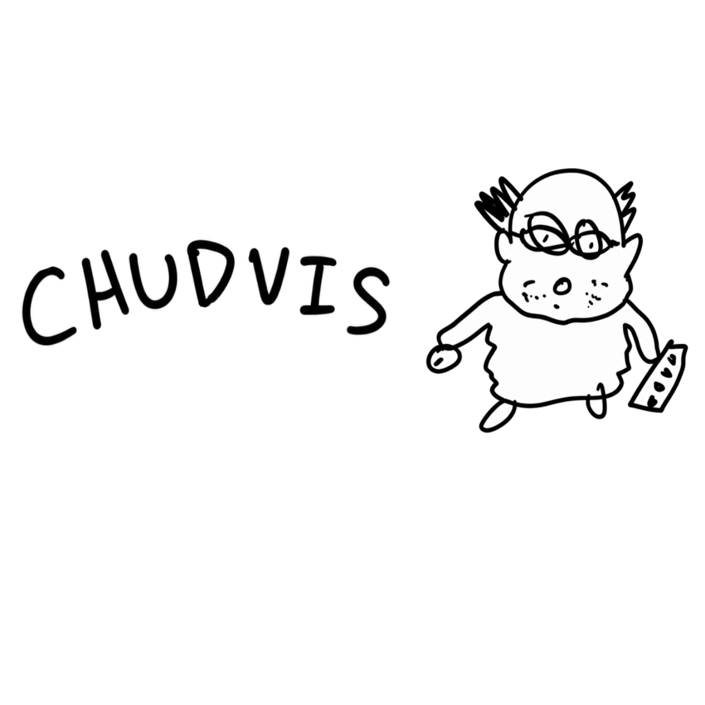

  

<h1 align="center">
    Chudvis
</h1>

> **Contact-free multi-modal coding in VS Code — your eyes point, your gestures commit, your voice does the rest.**

---

## Inspiration

Every developer tool assumes a mouse and a keyboard. That assumption excludes people with limited mobility, anyone recovering from an injury, and anyone whose hands are busy. We've spent millions in research understanding the ergonomics behind peripheral devices — and it's the single hardest factor to remove, because navigating our IDE/OS needs precision. The obvious fix is eye tracking, but on its own it fails. Gaze-only interfaces suffer the **"Midas touch"** problem: everything you look at gets clicked. We wanted to know if separating *where you're looking* from *what you're committing to* would be enough to make hands-free coding actually usable.

## What it does

Chudvis is a VS Code extension that turns a webcam and a microphone into a complete hands-free coding interface. It splits control across three modalities, each doing only what it's good at:

- **👁️ Gaze** → Your eyes move the cursor and select targets (think of this as your sensor).
- **✋ Gesture** → A deliberate hand gesture commits the action (think of this as your mouse clicks).
- **🎤 Voice** → Complex actions simplified via human interaction (think of this as your shortcuts).

A typical flow: look at a function, pinch with your navigator hand to select it, say *"Chudvis, refactor this to use async"*, and the proposed edit comes back for review. Thumbs-up with your editor hand applies it. Nothing irreversible happens without an explicit gesture, and every edit is undoable.

## How we built it

- **Architecture** — A TypeScript VS Code extension supervising a native Python runtime, communicating via a token-authenticated loopback socket with a versioned JSON schema.
- **Gaze** — MediaPipe `FaceLandmarker` iris landmarks, rebuilt into a head-normalized orthonormal face frame so gaze survives head movement, then fit with SVD-projected ridge regression (plus an RBF kernel variant). Adaptive blink rejection off a rolling eye-aspect-ratio median, One-Euro filtering on the output.
- **Gestures** — MediaPipe `HandLandmarker` feeding a hold-gated state machine. Left and right hands get distinct navigator/editor roles so pointing and confirming never collide.
- **Wake word** — sherpa-onnx int8 Zipformer keyword spotting, running entirely on CPU. No audio leaves the machine until you actually say "Chudvis."
- **Voice I/O** — ElevenLabs realtime WebSocket STT with server-side VAD in, streaming TTS out. faster-whisper as a fully offline fallback.
- **Intelligence** — Backboard fronting Anthropic and Google behind one key: tool-capable Claude for edits, cheaper Gemini for questions, with server-persisted threads so context carries across conversations.
- **Safety** — Model edits are validated before they land (exact-match checks, character budgets, path policy), then surfaced in a git-backed review flow.

## Challenges we ran into

**Calibration Drift.** Feeding full-strength features straight into regression meant a profile that worked at the start of a session was noticeably off twenty minutes later. Standardizing and SVD-projecting to a bounded set of components before fitting is what made calibration hold — and it's also what lets a profile converge from a few dozen samples instead of needing a per-user trained model.

**Midas touch as a design problem, not a tuning problem.** No amount of dwell-time tweaking fixed accidental activation. Requiring a separate modality to commit was the only thing that worked.

**Gesture Recognition on Raw Pose.** Instantaneous matching fires constantly on incidental hand motion. Every gesture had to arm over a hold duration with visible 0–1 progress, plus a grace window so a momentary tracking dropout mid-pinch doesn't drop your drag.

**Cross-Platform Compatability.** The camera, screen geometry, and DPI awareness all live on the Windows host, but the repo lives in WSL — so calibrating with a plain Linux `uv run` silently produces a profile with the wrong screen geometry. We ended up making the extension own the entire runtime lifecycle so calibration and live control are unified.

## Accomplishments that we're proud of

- **It actually works for real coding**, not just a scripted demo — precise enough to write/modify a specific function on a dense screen.
- **Zero Cloud Credentials for Gaze and Gesture Recognition.** The whole tracking stack runs locally.
- **Privacy-First Approach.** Wake-word spotting is fully on-device.
- **Ships as one `.vsix`** that provisions its own Python runtime via `uv` — no separate repo clone, no manual environment setup.
- **Security-First Approach**: keys in VS Code SecretStorage rather than workspace `.env` so project code can't read them, SHA-256-verified model assets, and a camera that never starts without an explicit user action and a first-run disclosure.
- **Malleable AI Edits.** We never let a model write to your files unsupervised.

## What we learned

- **Modality Separation Beats Modality Accuracy.** We spent early effort trying to make gaze smart enough to know when you meant it. Giving that job to a different body part solved it outright.
- **Feedback is what makes an Interface learnable.** The 0–1 arming progress fill did more for usability than any threshold we tuned — users need to see intent accumulating.
- **Classical ML was the right call.** Ridge regression over a projected feature space beat anything we could have trained in a weekend, and calibrates in under a minute. Furthermore, LLM parsing in comparison to regex allowed for a wide variety of complex translations to simple commands.
- **Privacy Boundaries are Architectural.** "Local until the wake word" had to be designed in from the start; it isn't something you can bolt on afterward.
- **Distribution is a feature.** Making the extension own the Python runtime eliminated an entire category of setup bugs and platform mismatches.

## What's next for Chudvis

- **Desktop mode beyond VS Code** — the gaze and gesture stack is already editor-agnostic; the OS-level pointer path needs polish.
- **More editors** — the bridge protocol is versioned and schema-defined specifically so JetBrains and Neovim adapters are feasible. Via the fork nature of vscode we are confident the tool would already work on cursor for real agentic handling.
- **Real-Time Calibration**, learning from confirmed selections rather than requiring a recalibration pass.
- **Improved Gesture Database**, including scroll and zoom, without sacrificing the deliberate-commit guarantee.
- **Accessibility User Testing** with the people this is actually built for — our biggest gap, and the thing that would most change the roadmap.
- **Latency Work** on the wake-word-to-response path, which is where the experience still feels like waiting.

## Built With

`elevenlabs` `backboard` `typescript` `python` `vscode-extension` `mediapipe` `opencv` `numpy` `sherpa-onnx` `claude` `google-gemini` `uv` `websockets` `machine-learning` `computer-vision` `accessibility` `privacy` `security`
